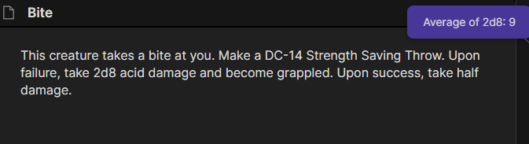
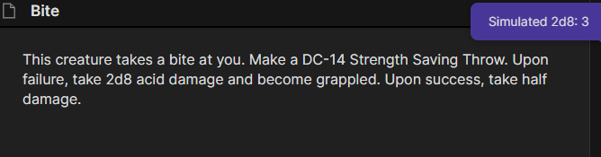

## Simple Dice Roller

This is a simple, plug-and-play dice roller that searches the current, active leaf and will simulate or average all dice formulas, regardless of where they are.

### How to use

- Simply install the plugin, then open the command pallette (CTRL+P by default), and search up `Simple Dice Roller` to see all available commands.
- You can assign shortcuts to the commands by going to Settings -> Hotkeys and then searching up `Simple Dice Roller`.
- Ribbon icons are available in Settings -> Plugin Option -> Simple Dice Roller
- Upon calling any of the commands, the plugin will search the current page for any dice formulas, defined as (XdY+Z). That is a number followed by a `d` followed by another number, and an optional `+`. There can be any number of dice. That is 1d10+2d6+4 is a valid formula, and will be calculated as a single formula.
- If there are no dice, the plugin will simply exit, providing an appropriate alert error.

### Screenshots
- `Average All Dice` in action

- `Simulate All Dice` in action

- When no dice are on the current page

### Manually installing the plugin

- Copy over `main.js`, `styles.css`, `manifest.json` to your vault `VaultFolder/.obsidian/plugins/simple-dice-roller/`.

### LICENSE

This project is licensed under the MIT license.